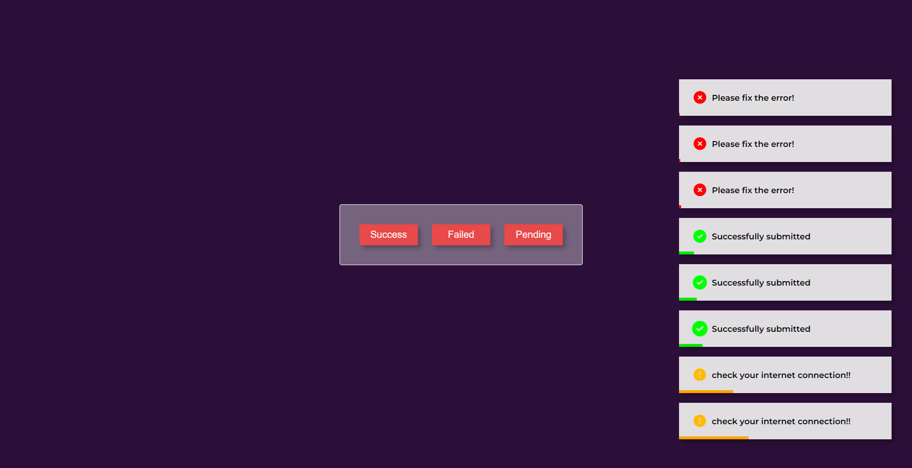

# Toast Notification Project

This is a simple **Toast Notification** project built using **HTML**, **CSS**, and **JavaScript**. The project showcases various toast notification messages such as success, failure, and pending statuses, which can be triggered by buttons on the interface.

## Features
- Responsive and visually appealing design.
- Includes three types of toast notifications:
  - **Success:** Green checkmark with a success message.
  - **Failure:** Red cross with an error message.
  - **Pending:** Yellow warning icon with a pending message.
- Smooth animations for showing and hiding notifications.

## Project Structure
```
TOAST NOTIFICATION/
|-- image.png          # Icon or image used in the project (if any)
|-- index.html         # HTML structure of the project
|-- script.js          # JavaScript functionality for triggering toast notifications
|-- styles.css         # CSS styles for layout and animations
```

## Font Used
The font used in this project is **Montserrat Medium**. Make sure to include the following Google Fonts link in your `index.html` file to load the font correctly:
```html
<link href="https://fonts.googleapis.com/css2?family=Montserrat:wght@600&display=swap" rel="stylesheet">
```

## How to Use
1. Clone or download this repository.
2. Open the `index.html` file in your browser.
3. Click on the buttons to trigger the respective toast notifications.

## How It Works
1. **HTML:** The `index.html` contains the structure for the buttons and notification container.
2. **CSS:** The `styles.css` defines the styling for the buttons, notifications, and animations.
3. **JavaScript:** The `script.js` adds interactivity, such as displaying and hiding notifications dynamically when the buttons are clicked.

## Preview


## License
This project is open-source and free to use for any purpose.

---

*Created with ❤️ by [Satyam](https://github.com/your-username).*# 02_WEB-D_Project
# 02_WEB-D_Project
